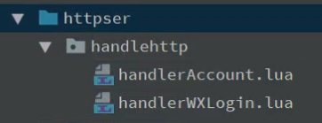
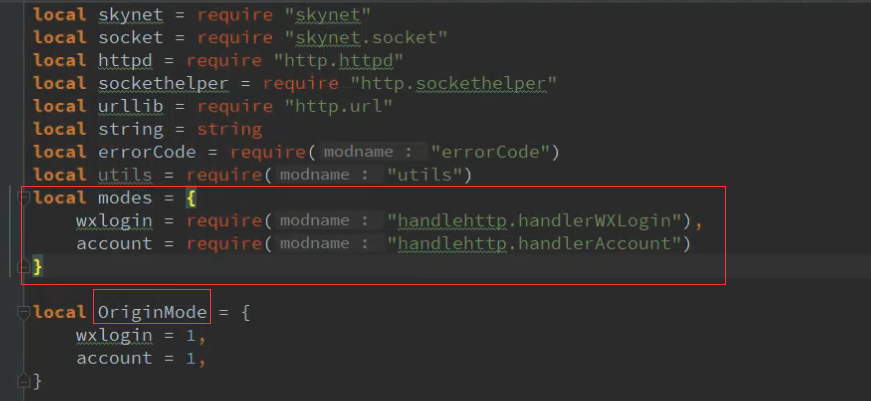
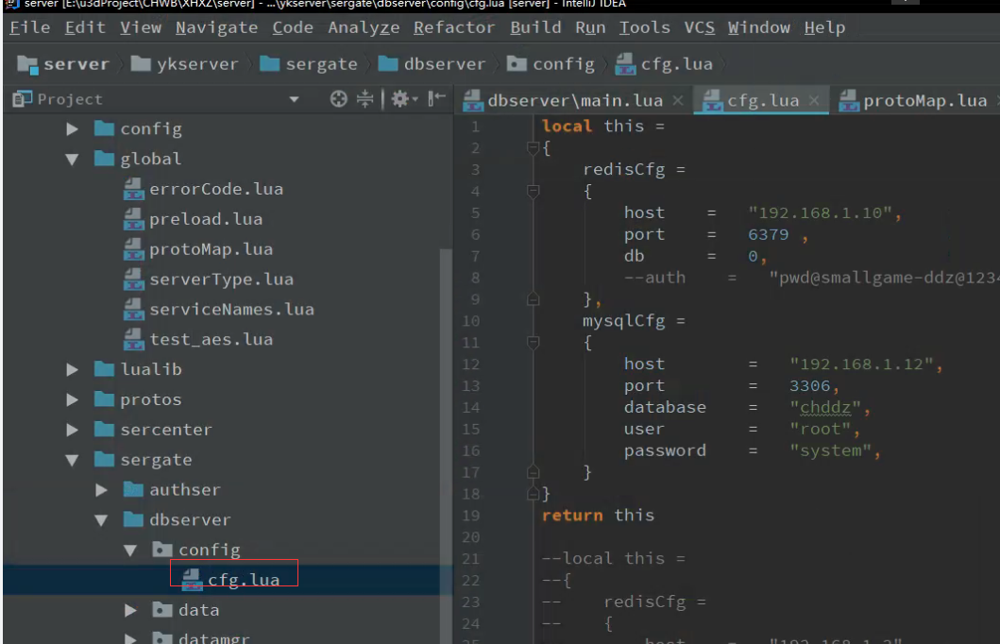

# skynet服务器框架说明

## 架构相关
- mysql 备份数据库 + redis运行时数据库
- websocket + hhtp协议
-  c语言核心lua语言写业务逻辑
-  Skynet为框架核心

## 目录结构
- ykserver `服务器逻辑代码`
	-  config `配置文件`
	-  global `全局使用脚本`
	-  lualib `一些公用的lua服务`
	-  protos `服务器协议文件`
	-  sercenter `中心服务 （暂时用不上，多服务架构用）`
	-  sergate `网关服务器 暂时所有服务器都放在网关服`
		-  authser `登陆相关的服务`
		-  chatserver `聊天服务`
		-  dbserver `数据库管理服务`
		-  httpser `http服务以及http相关服务`
		-  test `测试目录`
		-  main.lua `服务器最早启动的服务`
		-  ykwsgate.lua `websocket相关脚本`
		-  
	-  service `服务脚本`
	- skynet `skynet框架核心代码和源码`
- log `日志文件`
- start_ykserver_gate.sh `这个是启动脚本使用screen启动`
- test.sh `控制台运行服务器`
- 打包.bat  `编译lua文件`

## 框架特殊文件说明
socket包封装解析protoUtil
处理客户端的连接wsgateserver.lua
对客户端的消息进行分发distributeClientMsg
客户端会话管理gamesession


## 怎么编写一条HTTP协议
> 编写Http 例如编写一个账号登陆  首先在 httpser这个文件夹下新建一个文件夹
> 然后新建一个用来处理账号登陆的lua类
> 那么结构是
> 这个handlerAccount就是新的处理协议类
> 比如我们想要写一个创建账号createaccount  那么久在这个文件里面写

> ```
> local this = {}
> ---@param query 这个是请求的参数是个tabel表
>  ---@param body 这个是post请求的参数是个tabel表
>  ---@param header 这个是请求的头部信息
> function this.createaccount(query,body,header)
> ---编写你的逻辑代码
>     local ec,retData = errorCode.SystemError.unknow,nil --- ec就是你要返回给客户端的错误代码 retData就是数据直接返回table就行会自动转成json
>     return ec,retData 
> end
 > ```
> 最后配置下协议
> httpagent中加修改mode
> 接下来访问  ip:9100/?modeName="模块名称（这里就是modes里面填的）"&api=函数名称&参数1=值&参数n=值
> 最终 ip:9100/?modeName=account&api=createaccount&account=1234567&pwd=123456
> 代码请参考   sergate/httpser/handlerAccount.lua

## 编写一条wssocket 消息

>新增一个文件夹放在 sergate下，然后对照下面的authser
>main为必须叫这个名字
>service.modules.auth = require("impl") 注册 auth模块
>```
> function this.login(gs,loginReq)
>    local ec,data = errorCode.SystemError.unknow,nil
>    if not loginReq then
>       return ec
>    end
>   local token = loginReq.token
>    local roleid = loginReq.roleid
>   ec,data = ctrl.login(gs,token,roleid)
>    return ec,data
>end
>```
>然后配置下protomap文件
>```
>local auth =
>{
>  module          =   "auth",
>   service         =   serviceNames.auth,
 >  server          =   serverType.GATE,
 >   login           =
 >   {
 >       id          =   200,
 >       request     =   "loginReq",
 >       response    =   "loginResp",
 >       log         =   2,
 >       desc        =   "请求登陆",
>        needAuth    =   false
>
>    },
> }
> this.auth = auth
>```

## 启动
>配置服务器数据库账号密码
>
然后sh test.sh

使用 来创建账号 ip:9100/?modeName=account&api=createaccount&account=1234567&pwd=123456


## 发布服务器

先确保dbserver/cfg.lua 里面的配置是你想要发布到的服务器的数据库配置
如果确保无误
执行根目录下的 发布.bat
执行的过程注意看下错误，如果有错误看看是不是因为你系统是32位的，自行替换luac.exe   现在用的是luac5.3.5 luac


如果一切顺利应该会在根目录生成一个release的文件夹
里面有个pack的文件夹就是你打包后的文件
把这个pack上传到服务器上，然后给 所有的sh附上 可执行权限
（chmod +x ./*.sh）
然后再给skynet可执行文件执行权限
chmod +x ./skynet/bin/liunx/skynet

一切顺利后执行 sh start_ykserver_gate.sh

> 注意：需要先安装screen 

如果启动失败可以先 sh test.sh 直接在控制台启动，这样就可以看到启动失败的原因
